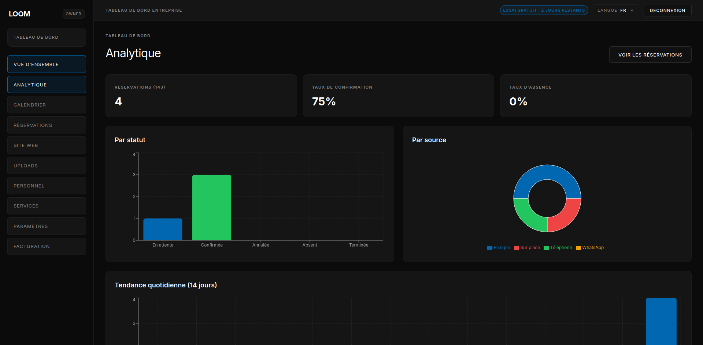

# LOOM

<p align="center">
	
</p>

<p align="center">
	<strong>Professional booking and business websites for service providers in Tunisia.</strong>
</p>

<p align="center">
	
</p>

## Product Identity

Loom’s landing and product UI follow a premium dark aesthetic:

- Dark base surfaces with glass-style cards
- Strong electric-blue accent for action and focus
- Clean, high-contrast typography and compact layouts
- Business-first tone: clear onboarding, clear contact, clear outcomes

### Core visual anchors

- Primary background: `#0b0b0b`
- Accent color: `#0067b0`
- Surface layers: near-black with subtle border contrast
- Rounded cards + soft shadows for depth

## Owner Onboarding Flow

The current onboarding model is:

1. Business owner creates account (`Start Free Trial`)
2. Owner contacts Loom team
3. Loom creates the business workspace and links it to the owner account
4. Full usage is activated

This flow is reflected in:

- Landing hero and contact sections
- Signup explainer block
- Sales-focused CTAs and contact actions

## Tech Stack

- Next.js 14 (App Router)
- TypeScript
- Tailwind CSS
- Supabase (Auth, DB, Storage)
- next-intl (EN / FR / AR)
- Recharts (analytics)

## Project Structure

- `app/` routes (landing, auth, dashboard, admin, APIs)
- `components/` UI sections and shared elements
- `lib/` business logic, Supabase clients, billing helpers
- `messages/` locale dictionaries (`en`, `fr`, `ar`)
- `public/` brand assets and preview images

## Local Development

### 1) Install dependencies

```bash
npm install
```

### 2) Configure environment

Create `.env.local` with required keys:

```env
NEXT_PUBLIC_SUPABASE_URL=
NEXT_PUBLIC_SUPABASE_ANON_KEY=
SUPABASE_SERVICE_ROLE_KEY=
NEXT_PUBLIC_APP_DOMAIN=
SUPERADMIN_EMAIL=

RESEND_API_KEY=
EMAIL_FROM=
NOTIFICATIONS_API_SECRET=
```

### 3) Run the app

```bash
npm run dev
```

Open http://localhost:3000

## Scripts

- `npm run dev` start dev server
- `npm run build` production build
- `npm run start` run production server
- `npm run lint` lint project

## Brand & UX Notes

When editing UI, preserve the existing Loom language:

- Keep CTAs explicit and business-oriented
- Prefer simple, premium layouts over dense visuals
- Avoid introducing off-theme colors
- Keep mobile nav and auth pages compact and centered

## Contact

- Email: contact@loom.tn
- Phone: +216 71 000 000
- WhatsApp: https://wa.me/21671000000
